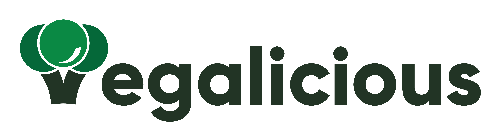

# Capstone C23-PR512

<!-- import image -->

## Project Description

Many people nowadays realize the environmental impact and benefits of a plant-based diet, which leads to an increasing number of individuals interested in transitioning to a vegan lifestyle. However, those who are new to this lifestyle often struggle to find suitable vegan foods and how to prepare them. A vegan lifestyle itself involves avoiding the use of animal products, especially in food. To tackle these challenges, our team needs to find ways to make it easy to prepare vegan foods and ensure adequate nutrition in a vegan diet. Therefore, we want to help those who want to switch to a vegan lifestyle by providing an accessible and user-friendly application. This application will assist users in finding information about vegan foods and how to prepare them, as well as the nutritional content of the prepared foods. With this application, we hope to assist users in making better decisions on their journey to a vegan lifestyle.

## Our Knight

| **Name**                   | **Bangkit ID**  |
| -------------------------- | --------------- |
| Jasmine Aulia Pramesty     | **M309DSY0511** |
| Abidjanna Zulfa Hamdika    | **M038DSX1317** |
| Binti Fitrothul Khasanah   | **M040DSY0262** |
| Septian Dwi Putra P        | **C309DSX0900** |
| Nadhira Aliya Zahra        | **C309DSY3242** |
| Muhammad Daffa Aldriantama | **A038DKX4473** |
